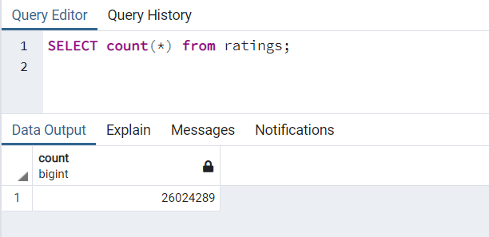

# Movies-ETL
## Overview
This week's focus was on a process known as Extract, Transform, Load, commonly reffered to as ETL.
The main purpose of ETL is that it allows businesses to consolidate data from multiple sources into a single database with data that has been properly formatted and ready for analysis. This  allows for simplified access for analysis and additional processing.

## Resources
Data sources: wikipedia-movies.json, movies_metadata.csv, ratings.csv **unable to upload due to GitHubs 100MB restriction while zipped file is 170.01MB

## Results
### Deliverable 1
In our extract step of ETL, we loaded in all of the data files we are using for our anaylsis and and created an ETL function written to read in the three data files.
We have functions created to conver the Wikipedia JSON file, the Kaggle Metadata file and the MovieLens ratings file to pandas dataframes.
### Deliverable 2
Continuing on to our second deliverable where we were asked to extract and tranform the Wikipedia data, we had to perform a little bit of data cleaning.
* we filtered out the TV shows
* dropped duplicate IMDB IDs
* cleaned up the box office, budge, release date, and running time columns using lamda and join functions 

And finally we converted the clean wikipedia data infor a Pandas Dataframe.
### Deliverable 3
Similar to deliverable 2, we had to extract and transform our Kaggle Metadata file to be analysis ready. Once the data was cleaned, we merged the two dataframes into a third dataframe called "Movies_df" by dropping all unnncessary columns and filling in missing kaggle data.
From there we cleaned out ratings counts and merged the movies_df with clean data into movies_with_ratings_df, filled empty values with "0" and displayed both databases for final submission.
### Deliverable 4
In our final stage of ETL, we copied our code from Kaggle Metadata and had some slight refactoring to do.
By making some slight changes to line #9 and #11 of our code we were able to add the movies-df and MovieLens rating csv data to a SQL database.
From here, we can see that there are 6052 rows in our movies table and 26124289(wow!) rows in our ratings table.

